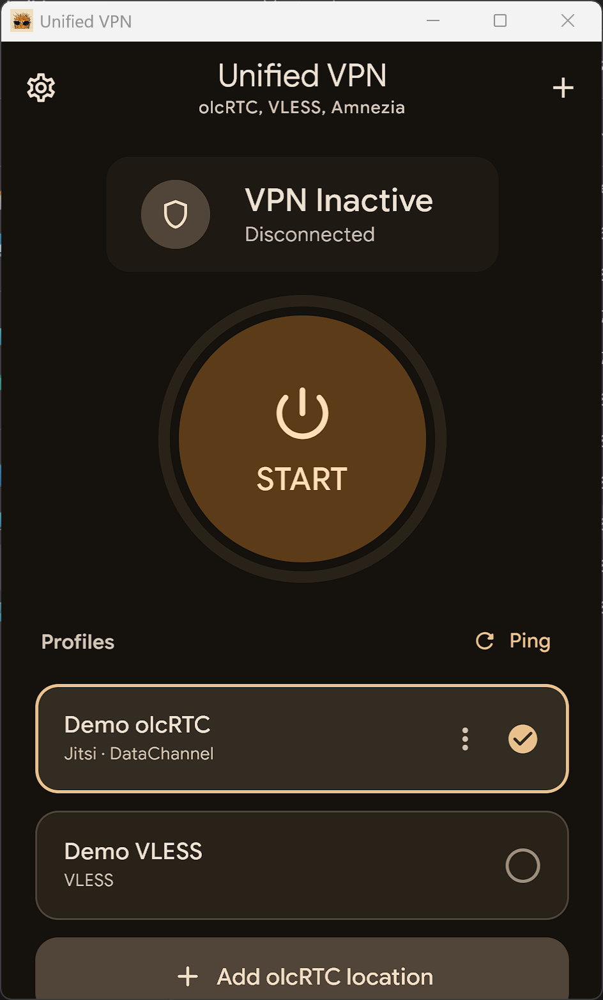
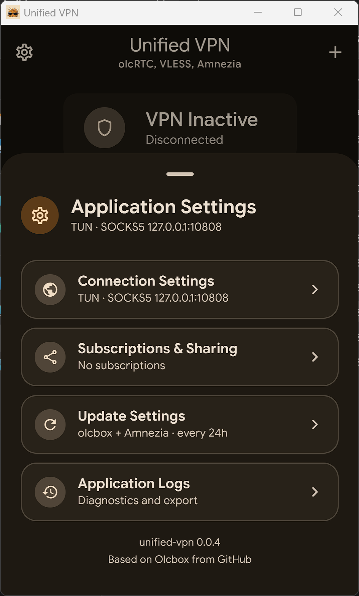
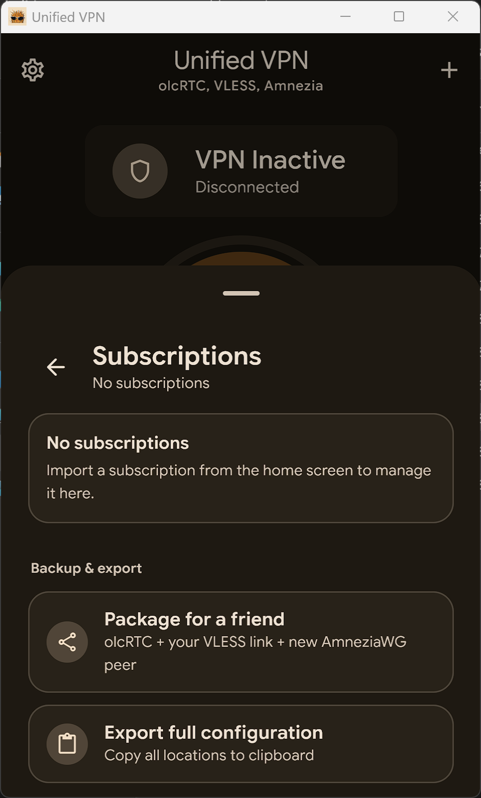

# Unified VPN

Android-first VPN client based on the original olcbox application by Alan Anisimov:
https://github.com/alananisimov/olcbox. It keeps the existing `olcrtc`
engine and adds a unified profile layer for `olcrtc`, VLESS, and Amnezia
profiles.

<p align="center">
  
  
  
</p>

## Status
Alpha version.
Not intended for production use.

Release history is maintained in [CHANGELOG.md](CHANGELOG.md).

## Legal Notice
This software is intended for development, testing and research purposes only.

The author does not provide any guarantees regarding:
- availability of network access
- compatibility with specific services
- compliance with any external restrictions

Users are solely responsible for how they use this software and must comply with applicable laws.

## Usage Restrictions
This software is not intended to be used for bypassing access restrictions or violating applicable laws.
The author does not support or encourage such use.

## Features
- One Android `VpnService` with selectable profile types.
- Imports `olcrtc://`, VLESS `vless://`, VLESS base64 subscriptions, AmneziaWG `.conf`, `awg://`, and Amnezia `vpn://`.
- VLESS runtime adapter through packaged `sing-box`; see `docs/ENGINES.md`.
- Self-hosted Amnezia WireGuard runtime through the packaged `sing-box` path; AmneziaWG obfuscation requires an AWG-capable core.
- One-tap tunnel start/stop with live relay status.
- Saved connection profiles with active location selection.
- Providers: Jazz, Telemost, WB Stream, Jitsi.
- Transports: DataChannel, VP8, SEI.
- VP8 tuning: FPS and batch size.
- Connectivity checks for individual locations.
- Config import from clipboard/file and export to clipboard.
- Diagnostics log view with log export.
- Android TUN/proxy modes, SOCKS5 credentials, separate split tunneling for olcRTC and VLESS/AmneziaWG.
- Network migration, reconnect handling, and watchdog recovery.
- Password-protected friend packages for Android and Windows: shared olcRTC profiles, an explicitly selected VLESS link, and one-action creation of a separate AmneziaWG peer.

## Updates

Unified VPN checks stable application releases at:
https://github.com/JosephTagirov/UnifiedVpn/releases.

Updates of the original [olcbox](https://github.com/alananisimov/olcbox) and
[Amnezia VPN](https://github.com/amnezia-vpn/amnezia-client) are shown as
upstream notices only. Unified VPN never installs upstream application assets
over itself.

## Secure Friend Packages

The friend-package creator includes only olcRTC profiles, the VLESS URI entered
for that friend, and verified SSH provisioning data. Existing VLESS and
AmneziaWG profiles are deliberately excluded, so an existing AWG private key is
never reused.

Packages are encrypted with AES-256-GCM. Send the encrypted package and its
password through different private channels. Do not publish either item. The
receiver creates a separate AWG peer and client private key; the SSH password is
not stored after provisioning.

## Platform Matrix

| Platform | Modes | Runtime |
| --- | --- | --- |
| Android | TUN, proxy | `VpnService`, `hev-socks5-tunnel`, local `olcrtc` SOCKS5, optional `sing-box` VLESS SOCKS |
| iOS | Proxy | local `olcrtc` SOCKS5 hosted by a Swift shell |
| macOS | Proxy | local `olcrtc` SOCKS5 with OS PAC settings |
| Windows | TUN | local `olcrtc` SOCKS5, `hev-socks5-tunnel`, Wintun |
| Linux | TUN | local `olcrtc` SOCKS5, `hev-socks5-tunnel`, policy routes |

## Requirements

| Area | Requirement |
| --- | --- |
| JVM | JDK 17+ |
| Android | Android Studio, Android SDK, Android NDK |
| Android olcRTC | Go, `gomobile`, and local `olcrtc` fork |
| Android VLESS | Packaged `sing-box` executable as `jniLibs/<abi>/libsing-box.so` |
| Desktop native assets | Go and local `olcrtc` fork |
| Linux TUN | `iproute2`, `/dev/net/tun`, root/Polkit/sudo privileges |
| Windows TUN | UAC elevation when TUN starts and bundled Wintun runtime |

Default local `olcrtc` path:

```text
../olcrtc
```

Override it with `OLCRTC_REPO`:

```bash
OLCRTC_REPO=/path/to/olcrtc ./gradlew :desktopApp:run
```

Relative `OLCRTC_REPO` values are resolved from the `olcbox` project root:

```bash
OLCRTC_REPO=../olcrtc-ansible-deploy/olcrtc ./gradlew :androidApp:assembleRelease
```

```powershell
$env:OLCRTC_REPO="C:\path\to\olcrtc"
.\gradlew.bat :desktopApp:run
```

## Commands

| Task | Command |
| --- | --- |
| Android debug APK | `./gradlew :androidApp:assembleDebug` |
| Install Android debug APK | `./gradlew :androidApp:installDebug` |
| iOS simulator app | `xcodebuild -project iosApp/iosApp.xcodeproj -scheme iosApp -sdk iphonesimulator -configuration Debug build` |
| Run desktop app | `./gradlew :desktopApp:run` |
| Run desktop app with hot reload | `./gradlew :desktopApp:hotRun --auto` |
| Build desktop native assets | `./gradlew :desktopApp:buildDesktopNativeAssets` |
| Package current host OS | `./gradlew :desktopApp:packageReleaseDistributionForCurrentOS` |
| Main checks | `./gradlew :sharedUI:jvmTest :desktopApp:compileKotlin :androidApp:assembleDebug` |
| JVM tests | `./gradlew :sharedUI:jvmTest` |

## Build Outputs

| Target | Command | Output |
| --- | --- | --- |
| Android debug | `./gradlew :androidApp:assembleDebug` | `androidApp/build/outputs/apk/debug/androidApp-debug.apk` |
| Android release | `./gradlew :androidApp:assembleRelease` | `androidApp/build/outputs/apk/release/androidApp-release.apk` |
| iOS simulator | `xcodebuild -project iosApp/iosApp.xcodeproj -scheme iosApp -sdk iphonesimulator -configuration Debug build` | Xcode DerivedData app product |
| macOS DMG | `./gradlew :desktopApp:packageReleaseDmg` | `desktopApp/build/compose/binaries/main-release/dmg/UnifiedVPN-<version>.dmg` |
| Windows EXE | `.\gradlew.bat :desktopApp:packageReleaseExe` | `desktopApp\build\compose\binaries\main-release\exe\UnifiedVPN-<version>.exe` |
| Windows MSI | `.\gradlew.bat :desktopApp:packageReleaseMsi` | `desktopApp\build\compose\binaries\main-release\msi\UnifiedVPN-<version>.msi` |
| Linux AppImage | `./gradlew :desktopApp:packageReleaseLinuxAppImage` | `desktopApp/build/compose/binaries/main-release/appimage/UnifiedVPN-<version>-amd64.AppImage` |

## Native Assets

| Asset | Path |
| --- | --- |
| macOS `olcrtc` | `desktopApp/build/generated/desktopNativeResources/native/olcrtc-darwin-arm64` |
| Linux `olcrtc` | `desktopApp/build/generated/desktopNativeResources/native/olcrtc-linux-amd64` |
| Linux `olcrtc` ARM | `desktopApp/build/generated/desktopNativeResources/native/olcrtc-linux-arm64` |
| Windows `olcrtc` | `desktopApp/build/generated/desktopNativeResources/native/olcrtc-windows-amd64.exe` |
| Linux `hev-socks5-tunnel` | `desktopApp/build/generated/desktopNativeResources/native/hev-socks5-tunnel-linux-amd64` |
| Linux `hev-socks5-tunnel` ARM | `desktopApp/build/generated/desktopNativeResources/native/hev-socks5-tunnel-linux-arm64` |
| Windows `hev-socks5-tunnel` | `desktopApp/build/generated/desktopNativeResources/native/hev-socks5-tunnel-windows-amd64.exe` |
| Windows Wintun runtime | `desktopApp/build/generated/desktopNativeResources/native/wintun.dll` |

## Notes

- Android native ABIs: `armeabi-v7a`, `arm64-v8a`, `x86_64`.
- Android release builds require `keystore.properties` in the repository root.
- macOS DMG output is not notarized unless signing/notarization is configured separately.
- Windows installers must be built on Windows with `jpackage` and WiX available.
- Linux TUN interface: `olcbox0`.
- Linux stop removes policy routes and reverts `systemd-resolved` settings when `resolvectl` is available.

`keystore.properties`:

```properties
storeFile=/absolute/path/to/release.keystore
storePassword=...
keyAlias=...
keyPassword=...
```

Linux privilege override:

```bash
OLCBOX_LINUX_PRIVILEGE=sudo ./gradlew :desktopApp:run
OLCBOX_LINUX_PRIVILEGE=pkexec ./gradlew :desktopApp:run
```
